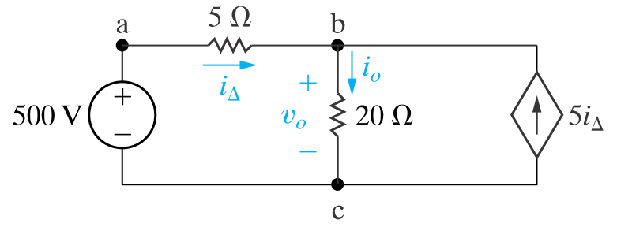

基爾霍夫定律是進行任何電路計算的基礎起點。

本書作者並未深入探討「電路為何總需形成封閉迴路」這一根本問題，也未嘗試從理論上證明或推導基爾霍夫定律，而是採取了一種實用主義的敘述方式。

首先提供一個具體電路圖，接著引入「節點」的概念，並據此說明基爾霍夫電流定律——流入任一節點的電流代數和為零。這一定律的本質，實為電荷守恆的體現。

隨後，介紹「迴路」的概念，並以此解釋基爾霍夫電壓定律——沿任一閉合迴路的電壓代數和為零，其物理內涵對應於能量守恆。

一旦掌握了這兩個電路學中的基本定律，原則上所有電路問題都可被求解。

然而，為了實現快速分析並獲得更有意義的視角，後續章節將進一步介紹大量用於簡化電路的技巧。

總的來說，作者在解釋這部分內容時，始終立足於實用立場：不追求嚴格的推導與證明，也不預先給出電路的抽象定義，而是直接透過實例，引導讀者聚焦於如何認識電路結構，並學會靈活運用這兩大定律。

---

說到這邊終於有電路了，看看以下的電路

對b節點使用基爾霍夫電流定律

$$
i_{\Delta} + 5i_{\Delta}= 6i_{\Delta} = i_o
$$

$$
v_o = 20i_o = 120i_{\Delta}
$$

對左邊的loop使用基爾霍夫電壓定律

$$
500 = 5i_{\Delta} + v_o = 125i_{\Delta}
$$

$$
i_{\Delta} = 500/125 = 4
$$

$$
i_o = 6i_{\Delta} = 24
$$

$$
v_o = 20i_o = 480
$$

這個例題綜合運用了先前介紹的獨立電壓源、受控電流源與電阻器，並透過基爾霍夫定律進行求解。

值得注意的是，上述求解過程並非唯一路徑，存在多種分析方法可供選擇。

由此也可預見，當面對更複雜的電路時，僅依賴這種基礎方法雖原則上總能得出答案，但過程可能顯得繁瑣且效率不高。

因此，接下來我們將逐步引入各種電路簡化技巧與更具洞察力的分析視角，以提升解題效率與對電路行為的理解。
