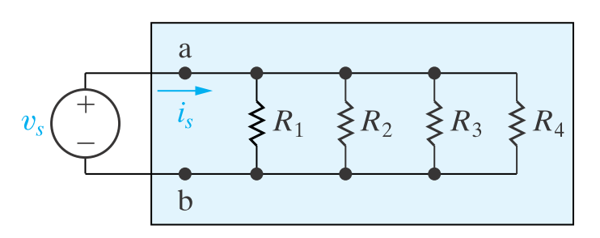

From Kirchhoff’s current law

$$
i_s = i_1+i_2+i_3+i_4
$$

from Ohm’s law

$$
v_s = i_1R_1 = i_2R_2 = i_3R_3 = i_4R_4
$$

$$
i_1 = \frac{v_s}{R_1}
$$

$$
i_2 = \frac{v_s}{R_2}
$$

$$
i_3 = \frac{v_s}{R_3}
$$

$$
i_4 = \frac{v_s}{R_4}
$$

$$
i_s = \frac{v_s}{R_1}+\frac{v_s}{R_2}+\frac{v_s}{R_3}+\frac{v_s}{R_4}
$$

$$
\frac{i_s}{v_s} = \frac{1}{R_{eq}} = \frac{1}{R_1}+\frac{1}{R_2}+\frac{1}{R_3}+\frac{1}{R_4}
$$

$$
\frac{1}{R_{eq}} = \sum_{i=1}^{k}\frac{1}{R_i}
$$

$$
G_{eq} = \sum_{i=1}^{k}G_i
$$