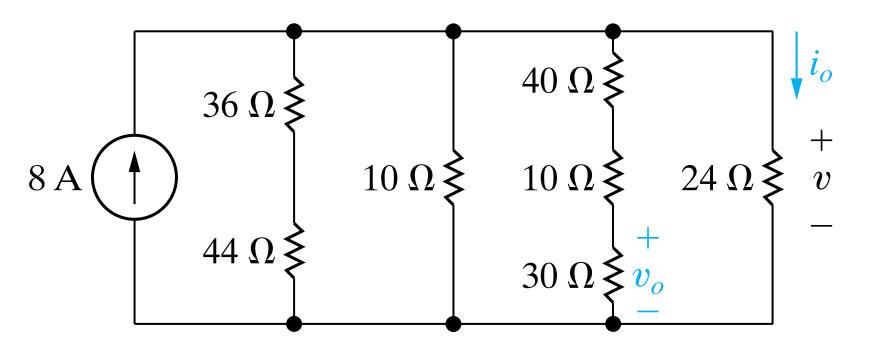

這個圖中可以看出 所求的$i_o$ 是 $8A$ 的電流源在 $80\Omega$、$10\Omega$、$80\Omega$、$24\Omega$ 四個並聯電阻中，分流至 $24\Omega$ 的電流

首先計算總電導：

$$
\frac{1}{80} + \frac{1}{10} + \frac{1}{80} + \frac{1}{24}
$$

$$
=\frac{3}{240} + \frac{24}{240} + \frac{3}{240} + \frac{10}{240}
$$

$$
=\frac{40}{240} = \frac{1}{6}S
$$

接著使用分流公式計算 $i_o$：

$$
i_o = \frac{1/24}{1/6} \times 8 = 2 A
$$

由此可計算 $v$：

$$
v = 24i_o = 48V
$$

再進一步用分壓公式計算 $v_0$：

$$
v_0 = 48 \times \frac{30}{80} = 18 V
$$

